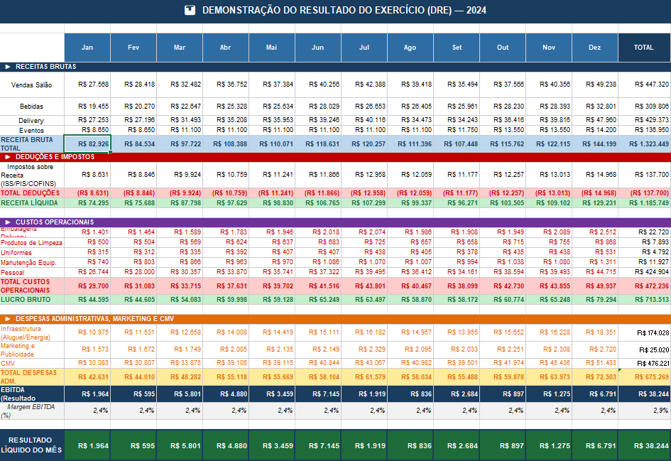

# Dashboard Financeiro - Restaurante Sabor de Casa

Automação de planilha financeira para gestão e análise de lucratividade de um restaurante/food service, com dados simulados de 2024.

> Projeto de portfólio desenvolvido para demonstrar habilidades em automação de planilhas financeiras com Excel.

---

## Preview

<!-- Cole aqui os prints do Dashboard e do DRE -->

### Aba Lançamento


### Aba DRE Mensal



### Aba Indicadores KPI


### Aba Dashboard


---

## Sobre o Projeto

O objetivo foi automatizar o controle financeiro de um restaurante, eliminando o processo manual de análise de ganhos e perdas. A partir de uma base de lançamentos, todas as métricas, indicadores e gráficos se atualizam automaticamente, sem necessidade de intervenção manual.

---

## Estrutura do Arquivo

| Aba | Descrição |
|-----|-----------|
| Lançamentos | Base de dados com todas as receitas e despesas mensais |
| DRE Mensal | Demonstração do Resultado por mês com fórmulas automáticas |
| Indicadores KPI | Principais métricas financeiras calculadas automaticamente |
| Dashboard | Visão gráfica e resumo executivo do desempenho anual |

---

## Como Funciona

A lógica é baseada em uma cadeia de dependências automáticas:

```
Lançamentos → DRE Mensal → KPIs → Dashboard
```

Qualquer alteração nos lançamentos se propaga automaticamente para todas as abas.

---

## Como Personalizar

1. Acesse a aba **Lançamentos** e altere os valores na coluna `Valor (R$)` e `Qtd/Unid`
2. Todas as abas se atualizam automaticamente (DRE, KPI e Dashboard)
3. Para incluir novos lançamentos, adicione linhas antes da última linha de dados
4. A coluna em **AZUL** são fórmulas, não edite diretamente

---

## Legenda de Cores

| Cor | Significado |
|-----|-------------|
| Azul | Receita Bruta e EBITDA |
| Verde | Resultado positivo / Receita Líquida |
| Vermelho | Despesa / Resultado negativo |
| Amarelo | Atenção: premissa importante |

---

## Técnicas Utilizadas

- **SOMARPRODUTO** para cruzar múltiplos critérios dinamicamente a partir da base de lançamentos
- **Referências entre abas** para atualização automática em cascata
- **Formatação condicional** para sinalização visual de resultados
- **Gráficos dinâmicos** vinculados à tabela de dados

---

## Observações

- Os dados são fictícios e foram gerados apenas para fins de demonstração
- O arquivo foi desenvolvido e testado no Microsoft Excel
